# Kuikly Stock 详细使用指南

适用版本：2026-09-11 当前 Android 开发版。本文根据当前代码整理；“行情进入个股”和资金周期切换已完成真机验证，其他操作说明不代表全部通过真机验收。后续版本的按钮位置可能调整。

## 1. 第一次使用：建议按这个顺序

1. 打开应用，查看首页的数据日期。
2. 进入“我的 → 立即更新数据”，等待更新结果。更新的是服务端已发布的行情快照，刷新不保证获得此刻的交易所实时行情。
3. 点击底部“行情”，搜索股票名称或六位代码，例如“平安银行”或“000001”。
4. 点击股票行进入详情，先看价格、涨跌幅和 K 线。
5. 点击标题栏星标，将股票加入自选。
6. 如需在线分析，进入“我的 → API 配置”，配置服务并测试连通。
7. 回到个股详情，点击“AI分析”，阅读结论后点击价位或证据日期，对照图表核查。

不配置在线 API 也可以浏览本地行情。在线 AI 请求可能消耗所配置服务的额度。

> 界面参考：首页顶部显示 A 股本地数据日期与刷新入口，中间是研究工作台（AI 研究室 / 组合风险 / 全市场 / 自选仓 / 盈亏日历），底部为五个主 Tab。

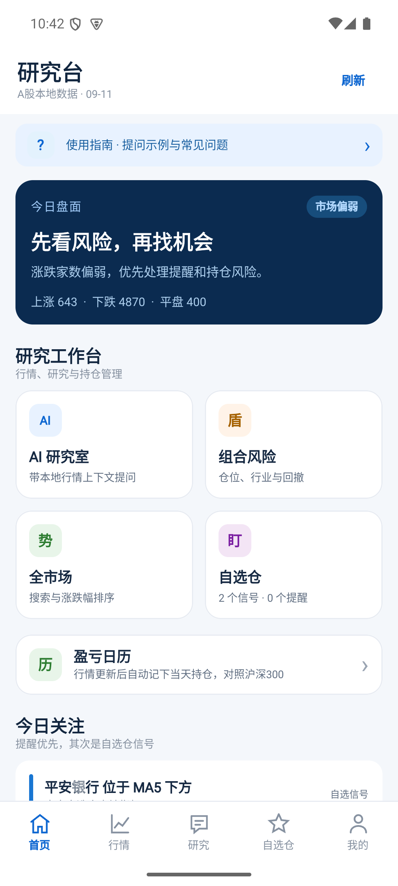

## 2. 五个主要入口

| 入口 | 可以做什么 | 建议使用场景 |
| --- | --- | --- |
| 首页 | 查看盘面概况、今日关注，进入研究工作台和盈亏日历并刷新行情 | 每次打开应用先确认数据日期 |
| 行情 | 搜索股票，按涨幅、跌幅、成交量等排序，进入个股详情 | 找股票、看走势 |
| 研究 | 与 AI 对话、追问、管理历史会话 | 提出具体研究问题 |
| 自选 | 管理关注股票、持仓信息和提醒 | 持续跟踪少量标的 |
| 我的 | 配置 API，查看行情状态，手动更新数据 | 初始化和排查配置问题 |

首页读取本地数据，本身不会自动发起付费 AI 分析。列表和页面较长时上下滑动；键盘挡住列表时先收起键盘。

## 3. 行情列表：找到并打开股票

1. 点击“行情”。
2. 在搜索框输入名称或代码，点击“搜索”。
3. 使用“默认”“涨幅”“跌幅”“成交量”切换列表排序。
4. 点击一整行股票，打开详情页。
5. 使用左上角“返回”回到上一页。

列表通常以红色表示上涨、绿色表示下跌、灰色表示平盘。遇到价格为 0、数据为空或长期不变的股票，应先检查数据是否缺失、标的是否停牌或退市，不能直接把显示值当作可成交报价。

“000001”存在股票与指数代码重叠：平安银行为 000001.SZ，上证指数为 000001.SH。AI 提问时优先写名称，或加市场后缀。

> 界面参考：列表顶部为搜索框与“搜索”按钮，下方是“默认 / 涨幅 / 跌幅 / 成交量”排序栏，右侧为涨（红）/ 跌（绿）/ 平（灰）图例。

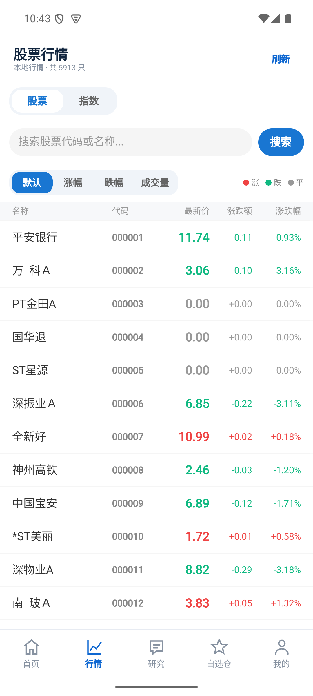

## 4. 个股详情：从上到下怎么看

建议依次查看“行情 → 同业 → 官方板块 → K线 → 分时 → 盘口与指标 → 资金 → AI依据”。

| 区域 | 主要内容 | 使用要点 |
| --- | --- | --- |
| 标题栏 | 名称、代码、星标、AI分析 | 星标加入或移除自选 |
| 实时行情 | 最新价、涨跌、开收高低、量额、估值 | 模块名不代表逐笔实时更新，仍需核对快照日期 |
| 同业 | 样本均值和个股相对表现 | 点击“排行”展开 |
| 官方板块 | 所属板块指数涨幅、领涨股、涨跌家数、市值、个股相对板块与板块内排名 | 点击“排行”按涨幅排序；点击“板块对照问 AI”可结合板块成分提问；快照日期见卡内 |
| K线走势 | 日/周/月K、均线、成交量、指标副图 | 结合日期和周期读图 |
| 分时 | 分钟价格、均价和成交量 | 数据可能与行情快照不在同一时点 |
| 五档盘口 | 买卖档位和数量 | 是可用数据的展示，不代表实时撮合队列 |
| 技术指标 | MACD、KDJ、RSI 数值与副图 | 副图可切 MACD/KDJ/RSI |
| 主力资金 | 最近交易日、近5日、近10日 | 点击某日跳转日K |
| AI智能解读 | 结论、价位、风险和行情依据 | 用证据核查结论 |
| 分析记录 | 本机历史分析 | 查看生成时间及依据行情日期 |

AI 结论生成后，行情旁和 K 线附近会显示关联提示。历史结论可能沿用旧数据，看到“日期不同”等提示时，应先核对日期，再决定是否重新分析。

> 界面参考：顶部标题栏含返回、股票名称代码、刷新、星标（收藏）与“AI分析”；行情卡显示快照时间（在线时显示“实时·已更新 HH:MM:SS”）、最新价、涨跌额、涨跌幅、开收高低与量额估值；往下依次为官方板块、公司事件、K线走势等区域。

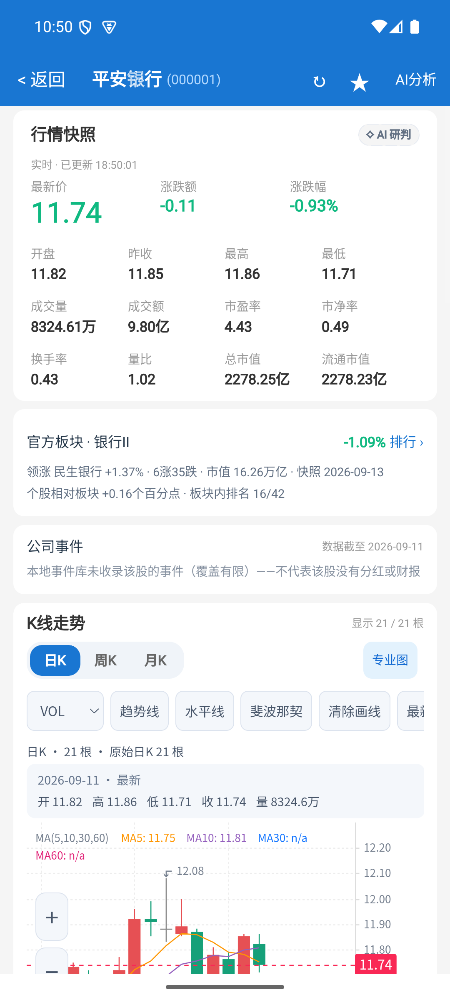

## 5. K线操作详解

### 5.1 周期和指标

- **日K / 周K / 月K**：切换观察周期。周、月K由已有日线聚合，切换不会凭空增加历史数据。
- **MA**：切换均线显示。
- **量**：切换成交量显示。
- **副图“关 / MACD / KDJ / RSI”**：选择一个指标副图，与主图日期对齐；RSI 为 6/12/24 三线，附 30/70 超买超卖参考线。
- **趋势**：叠加自动支撑/压力趋势线，连接近期摆动高、低点并向右延伸。这是自动识别的参考线，不是自由绘制，也不会保存。
- **“− / +”**：改变可见K线数量；按钮可作为手势缩放的替代方式。
- **左右箭头**：移动可见区间。
- **重置**：恢复图表视口，便于重新观察。

显示根数受本地历史长度限制。例如总共只有23根，缩小视图也不会显示数年历史。

> 界面参考（基础图）：K 线区顶部为“日K / 周K / 月K”周期切换与“基础图 / 专业图 / MA / 工具”按钮；下方为副图选择（关 / MACD / KDJ / RSI）、趋势开关与量开关；图表左侧有“＋ / －”缩放按钮（也可用双指手势），底部为成交量柱。

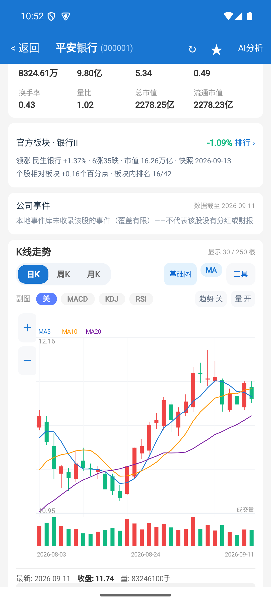

> 界面参考（专业图）：点击“专业图”后进入 WebView 渲染的图表，工具栏为“VOL / 趋势线 / 水平线 / 斐波那契 / 清除画线 / 最（重置）”，支持指标切换、画线与区间解读。

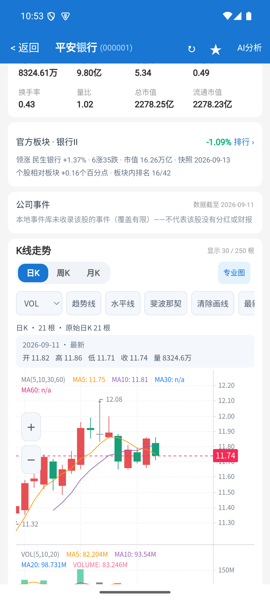

### 5.2 触摸手势

| 操作 | 预期效果 | 注意事项 |
| --- | --- | --- |
| 点击一根K线 | 选中该日并查看数据 | 有AI价位时可对照距离 |
| 未选中时横向拖动 | 平移历史窗口 | 已显示全部数据时移动空间有限 |
| 已选中后横向拖动 | 移动查看位置，逐根读数 | 与未选中时的平移行为不同 |
| 长按后横向拖动 | 选择区间并查看统计 | 先保持按住，再移动手指 |
| 双指张开或收拢 | 缩放可见区间 | 受最少显示数量和总数据量约束 |
| 竖向滑动 | 滚动详情页 | 尽量保持明确的竖向方向 |

“趋势”开关提供的是自动识别的支撑/压力线；仍没有自由绘制、保存趋势线的工具。上述手势已接入 Android，但不同设备的手势冲突与流畅度仍需进一步回归。

### 5.3 AI 与图表如何联动

1. 点击“AI分析”，等待结果生成。
2. 点击支撑、压力、目标或止损等价位，在K线上对照虚线标注。
3. 点击某根K线，查看当日数据及可用的AI价位距离。
4. 在“AI引用的行情依据”中点击“定位某日期的K线与成交量”，跳转到对应位置。
5. 日期定位会使用日K；如果本地没有该日数据，会显示提示，不会补造K线。

价位虚线是分析参考，不是委托单，也不会自动交易。

## 6. 分时、盘口与技术指标

**分时图：** 点击或横向拖动可查看对应分钟，使用均线与成交量开关调整显示。加载失败时点击“重试分时”。分时图当前没有双指缩放功能，也没有分钟级资金流叠加。

> 界面参考：分时图上方为“行情依据·与K线联动”提示，图内蓝色为价格曲线、橙色为均价，下方柱状为成交量，底部标注今开、最新、最高、最低与振幅。

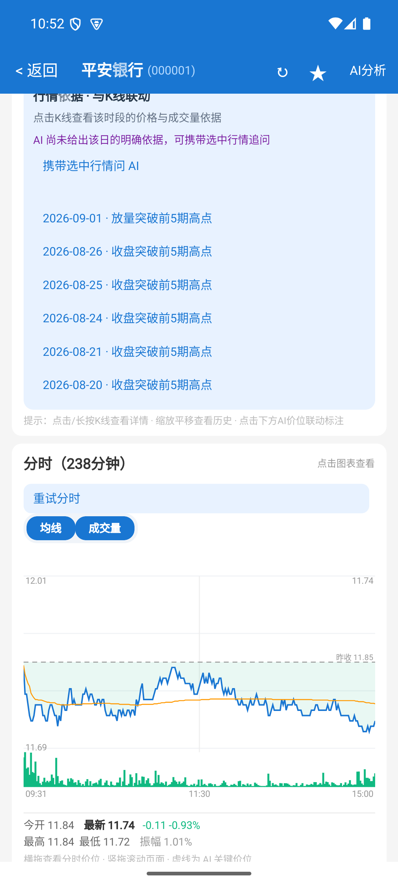

**盘口：** 查看买卖五档价格与数量，并核对是否有可用数据。当前不应按逐笔成交、大单追踪或完整盘口队列来使用。

**技术指标：** 先看数值，再切换K线中的 MACD、KDJ 或 RSI 副图进行对照。缺数据或样本太短时，指标解释能力有限；RSI 既有数值也可切换副图（6/12/24 三线）。

## 7. 主力资金：周期、日期定位和追问

1. 向下滑动到“主力资金”。
2. 点击“最近交易日”“近5日”或“近10日”。
3. 查看“截至日期”和“实际几个交易日”，确认本次统计覆盖范围。
4. 阅读各日主力净流入、净占比和区间累计。
5. 点击一行日期，定位到对应日K。
6. 点击“结合这段资金流问 AI”，进入研究室，对当前区间的资金和K线做联合分析。

横条表示该窗口内净流入金额绝对值的相对大小；红色为净流入、绿色为净流出。切换窗口后横条的比例会重新计算，不适合跨窗口直接比较长度。

> 界面参考：盘口区（卖2—买5、现价、委比委差，价位可“标注”到 K 线或设“提醒”）→ 技术指标区（MA / MACD / RSI / KDJ）→ 主力资金区（“最近交易日 / 近5日 / 近10日”切换，列出各交易日净流入与涨跌幅）。

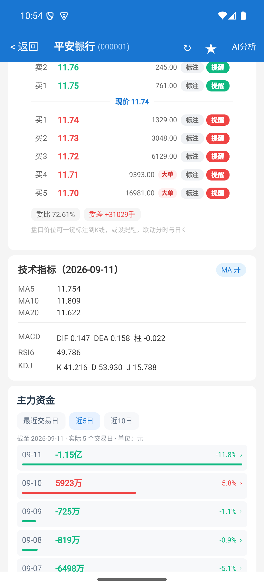

金额会以万、亿等形式显示；净占比是百分比。区间累计是已展示交易日的净流入合计。选择“近10日”但实际只有5日时，应按5日解读，不能当成完整10日数据。

当前以日级主力数据为主，不保证每只股票都有资金数据，也不保证超大单、大单、中单、小单分档齐全。“最近交易日”不一定是今天；没有数据时会显示空状态。

## 8. 同业比较：展开、排序和跳转

1. 在行情卡下方找到“同业”。
2. 查看“样本均值”和“个股相对”。
3. 点击“排行”，查看样本日期和同日有效股票数量。
4. 点击“切换涨幅排序”，在从高到低、从低到高之间切换。
5. 在列表内滚动查看其他股票；点击股票行进入该股详情。
6. 点击“同业对照问 AI”，让AI结合这组样本解释相对表现。

这里使用本地同一行业、同一快照日期且报价有效的股票，计算等权平均涨跌幅。无行业信息时可能不显示此卡。

“个股相对”是个股涨跌幅减去样本平均涨跌幅，单位为**百分点**。例如个股上涨2%，样本平均上涨0.5%，相对表现为+1.5个百分点。

这不是官方行业指数，也不是全市场实时板块榜；样本可能包含当前股票。查看强弱时应同时看日期、有效样本数量和覆盖范围。

## 8.1 官方板块：对照与排行

1. 在“同业”下方找到“官方板块·xxx”，显示所属东财行业板块快照。
2. 查看板块涨幅、领涨股、上涨/下跌家数与板块总市值；下方为“个股相对板块”和“板块内排名”。
3. 点击“排行”展开成分股列表，可切换涨幅从高到低/从低到高。
4. 点击成分股行进入该股详情；点击“板块对照问 AI”可结合板块成分与个股位置提问。
5. 卡内“快照日期”为数据日期（日级快照，非逐笔实时）。个股相对板块 = 个股涨跌幅 − 板块成分等权平均涨跌幅（百分点）。

板块数据来自东方财富官方行业板块列表与成分股，随每日数据构建生成；当日数据盘中未收盘时可能为上一交易日快照。

## 9. AI研究室：配置、提问、追问

### 9.1 配置在线服务

入口：“我的 → API配置”。填写配置名称、服务地址、模型ID和API Key，测试连通后启用。使用服务商提供的准确地址和模型名称，不要把模型显示昵称误当作模型ID。

Android 端 API Key 通过本机加密存储保存。在线提问会把问题及相关分析上下文发送到你配置的服务，请按自己的数据使用要求选择服务。

### 9.2 推荐的提问方式

| 目的 | 示例 |
| --- | --- |
| 初次分析 | 请分析平安银行，先写明行情日期，再说明趋势、支撑压力和风险。 |
| 核查结论 | 你说它偏强，具体由哪些日期的价格和成交量支持？ |
| 资金对照 | 结合当前提供的近5日资金数据，说明哪些变化与K线一致，哪些存在分歧。 |
| 同业比较 | 解释该股相对同业样本的表现，并注明样本数量和日期。 |
| 多股比较 | 对比贵州茅台和五粮液，分别说明趋势与风险，缺失数据请明确指出。 |
| 历史复核 | 这份旧分析的依据日期是什么？与最新行情有哪些变化？ |

输入名称或代码通常比“这只股票”更明确。卡片类型取决于问题、可用数据和回答解析结果，并非每次回答都会生成全部卡片。

> 界面参考：研究室顶部显示当前模型（如 DeepSeek·deepseek-flash）与“历史”入口；空状态提供常用快捷问题（“帮我分析600519”“今天大盘怎么样？”等），点击即可填入输入框。

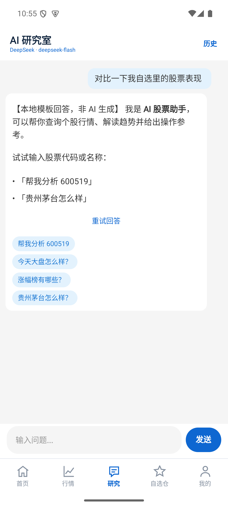

### 9.3 对话管理

- 点击建议追问，可沿当前主题继续提问。
- 长按消息可使用复制、引用或删除等操作。
- 生成中可停止；失败后可重试。
- 从“历史”打开会话列表，管理新建、切换、置顶、重命名或删除。
- 会话更多菜单提供Markdown导出或JSON备份等操作；保存、分享和复制按实际菜单选择。
- 离线模式使用本地数据与模板，能力和表达深度不同于在线模型，也不会自动获得最新网络信息。

> 界面参考：历史抽屉从右侧滑出，含“＋ 新建对话”与会话列表；当前会话高亮并标注“当前会话·共N条消息”，每条右侧三点菜单可管理。

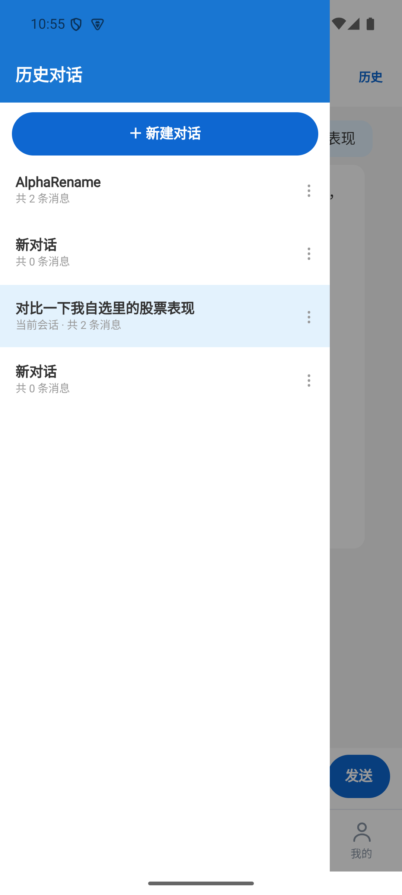

## 10. 分析历史与自选提醒

**分析历史：** 个股分析生成后尝试自动保存到本机。向下找到“分析记录”，点击“展开 / 收起历史”，再选择“查看”或“删除”。查看历史会切换到当时的结论，应同时核对生成时间、行情日期和来源。个股分析记录与AI聊天会话是两类历史。

**自选：** 在个股详情标题栏点击星标加入，再次点击可移除。进入“自选”管理关注股票。

> 界面参考：自选仓页顶部为持仓总览（持仓市值、累计盈亏、今日盈亏独立数字区），下方为关注股票列表，每行提供“设置持仓/提醒”与“移出自选”操作。

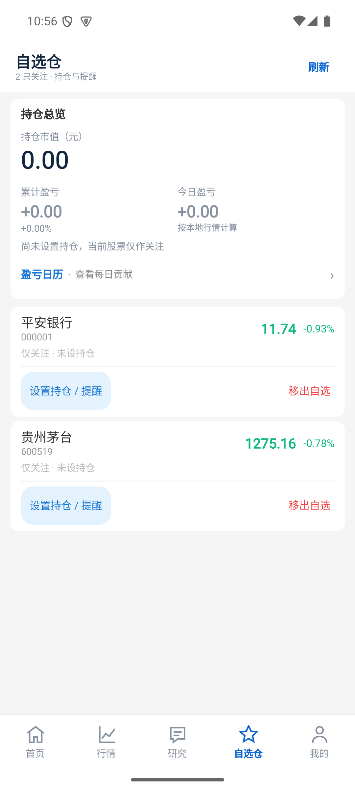

**持仓：** 在自选中录入股数与成本，供市值、盈亏、组合风险和盈亏日历使用。这是本地记录，不会连接券商账户或执行交易。

**提醒：** 可设置价格涨破、跌破或涨跌幅阈值；AI价位提供提醒入口时，先核对方向和阈值再保存。提醒依赖应用对最新本地数据进行检查，不能视为持续后台实时监控，也不能保证锁屏后即时推送。

**盈亏日历：** 从首页、自选总览或“我的”进入。每次行情快照更新时，自动记下当天持仓市值和当日盈亏；无持仓的日子不落记录，也不会用 K 线回填接入前的历史。同一天再次更新会覆盖当天快照。点某一天可看各股贡献；格子旁标跑赢或跑输沪深300。统计头给出日胜率、连盈连亏、最大单日盈亏和当月合计；下方热力图用红绿深浅表示幅度。涨跌停、提醒触发会打点。除权除息和财报日需要独立数据源，当前行情库没有这两张表时不会出现标记。

> 界面参考：未设置持仓时显示空状态卡片，提示“在自选仓分别填写每只股票的股数、成本和起始日期”，并提供“去自选仓设置持仓”按钮。

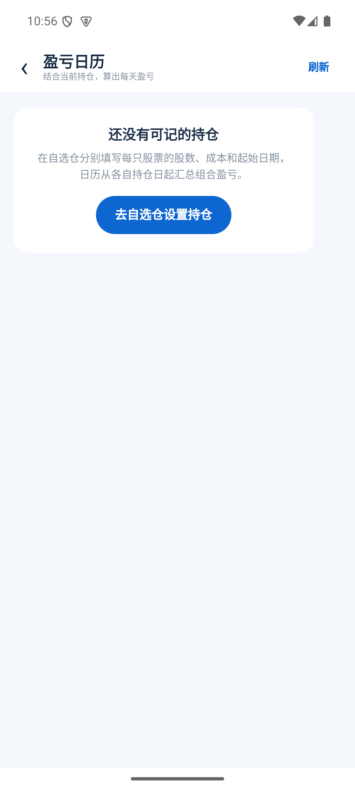

## 11. 组合风险

从首页研究工作台进入“组合风险”。先在自选中录入持仓，否则可能只显示空状态。

重点查看组合市值、盈亏、单股和行业集中度，以及命中的风险规则和提醒。所有计算依赖已录入持仓及可用行情快照，缺失持仓或行情会影响结果。

## 12. 数据更新：怎样判断信息是否新鲜

每次研究至少核对三个时间：

1. 首页或数据状态中的行情快照日期。
2. 图表、资金、同业各自显示的日期。
3. AI分析的生成时间与依据行情日期。

生成时间较新，不代表底层行情较新。不同模块来自不同数据链路，日期可能不一致。点击刷新是获取已发布数据，并不保证每个模块同时更新。离线时仍可读本地数据，但无法获取新的在线结果。

> 界面参考：“我的”页服务区提供盈亏日历、API配置、行情数据、立即更新数据；数据来源区可切换离线/在线模式并“检测AI服务连接”；外观区可切换浅色/深色主题。

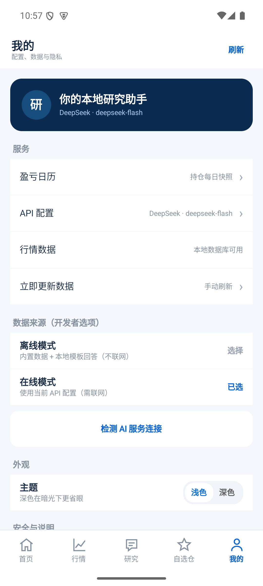

本文的新资金和同业能力以Android版为准；不要据此假定iOS、Web具有同等数据覆盖和手势表现。

## 13. 常见问题与处理顺序

| 问题 | 处理方式 |
| --- | --- |
| 点击个股后退回上一页 | 该版本曾出现资金卡渲染崩溃，修复版已安装并验证平安银行入口；若再发生，记录股票代码、入口、时间和复现步骤 |
| 搜不到股票 | 核对六位代码或完整名称，刷新后重试，确认本地库是否包含该标的 |
| K线拖不动 | 检查是否已经展示全部历史；已选中时横拖用于逐根查看，可先重置 |
| 图表日期定位失败 | 当前日线可能不含该日，或证据日期与本地数据不一致 |
| 分时为空 | 检查网络并点“重试分时”；仍失败时先用日K查看，不把空数据理解为零成交 |
| 近10日只显示几天 | 查看“实际交易日”数量，说明当前可用数据不足10日 |
| 同业卡没有显示 | 当前股票可能没有可用行业归属；不能据此判断它没有同行 |
| AI分析失败 | 先检查网络、当前启用配置、模型ID和测试连通结果，再重试 |
| AI结论与现价不一致 | 核对历史分析日期和行情日期，必要时重新分析 |
| 刷新后日期没变化 | 服务端可能尚未发布新快照，或当前已是可用最新版本 |
| 提醒没有即时出现 | 提醒依赖本地数据和检查时机，不是交易所实时推送 |

反馈问题时提供“从哪个入口 → 点击什么 → 实际结果 → 预期结果”，附股票代码和时间；无需提供API Key。

## 14. 一次完整的研究操作示例

1. 在“我的”更新数据，确认当前快照日期。
2. 在“行情”搜索平安银行并进入详情。
3. 查看日K，用MA和MACD副图对照趋势。
4. 点击某根K线读数，再查看分时与盘口的可用数据。
5. 展开同业排行，记录样本日期、数量和相对表现。
6. 切到近5日资金，点击一天对照日K。
7. 发起AI分析，点击其证据日期和价位核查。
8. 如有疑问，用“结合这段资金流问 AI”或明确的问题追问。
9. 将股票加入自选，按需要记录持仓或设置提醒。
10. 下次打开时，先检查数据更新，再对照旧分析是否仍适用。
